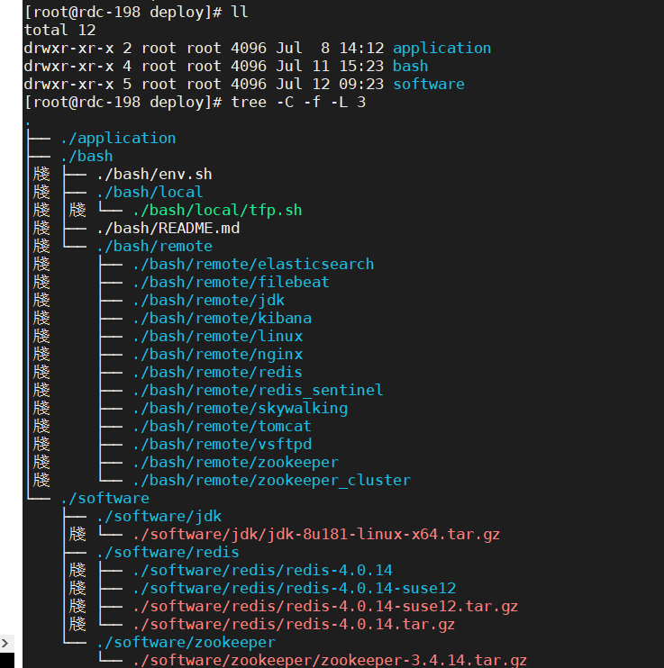

# 自动部署脚本使用指南
## 1. 文件夹说明
### 1.1 部署文件夹
可自定义，如`/data/deploy`，里面包含这个自动部署所需的一切文件，如脚本、软件包、应用，
这个文件夹放在专门部署操作用的一台服务器上即可，可以从服务器里面随便抽出一台放这个。

这个文件夹的子目录说明：
1. `bash/`：用到的所有脚本
    - bash项目下 local、remote文件夹 和 env.sh。
1. `software/`：所有的中间件安装包放在这里，如tomcat、zookeeper等。
1. `application/`：所有的应用war包放在这里。



### 1.2 目标文件夹
可自定义，如`/data/tfp`。这个文件夹放在`所有`的自动部署目标服务器上面，需要事先创建好，并设置所属用户为ssh使用的用户。
所有中间件、应用的安装，会放在这个目录下。

这个目录下的文件目录结构由脚本自动产生：
1. `bash/`：远程下载脚本、并在本机运行的文件夹；
2. `software/`：所有的非tomcat中间件安装目录；
3. `tomcat/`：所有的tomcat应用、war包安装目录

## 2. 配置说明
自动部署脚本所有用到的参数配置在`bash/env.sh`里面，需要所有操作进行之前，需要把这个配置好，确认无误。

脚本里面已经有注释了，这里再详细说一下。

### 2.1 通用配置
因为自动部署脚本需要人工在一台机器上操作，控制多台服务器，这些安装包、war包需要共享，起一个http文件服务是最方便的方式；
`env_http_file_server_host`、`env_http_file_server_port`用来配置这个服务的ip、端口。

`env_deployPath`是在这台主机自动部署项目控制路径，`env_tfpPath`是远程主机项目部署路径，
这两个路径在上面提到过，需要事先创建并设置用户。

### 2.2 主机配置
`env_nodes_all`所有主机名，使用空格` `隔开，需确保每个主机ip有一个唯一的名字，命名规则同java；

`env_node_上面起的主机名`，里面填这个主机的详细配置，里面有示例，`user`填ssh用户名，`host`写ip，`ssh_port`写ssh的端口号，
`apps`填在这台主机部署的应用，使用空格隔开。
可选的应用名有：
```
jdk
redis redis_master redis_slave redis_sentinel_1 redis_sentinel_2 redis_sentinel_3
dubbo_monitor dubbo_admin
elasticsearch filebeat kibana
ftp
nginx
skywalking skywalking_agent
zookeeper zookeeper_cluster_1 zookeeper_cluster_2 zookeeper_cluster_3
acccore adminhomepage adminsys basecore cachemanager checksys fundbudsys homepage intraccsys
settlesys taskser usercore warningser websys workflow
```
注意必须填这些应用名，否则无效。

### 2.3 elasticsearch、kibana、skywalking、filebeat
注意是一些端口号的配置
1. `env_elasticsearch_port` elasticsearch的端口
1. `env_elasticsearch_jvm_mem`是elasticsearch的jvm内存大小，建议大于4g
1. `env_kibana_port` kibana的端口
1. `env_skywalking_grpc_port`、`env_skywalking_rest_port`、`env_skywalking_webapp_port` skywalking的三个端口
1. `env_filebeat_log_path_pattern` 配置应用打log的路径，比如`/data/tfp/logs/**/*-filebeat.*.log`
1. `env_filebeat_log_index_pattern` 配置应用log在es建的索引名，如，配置`tfp`，生成的索引名`log-tfp-2019.06.24`

### 2.4 redis
现在是使用redis集群的哨兵模式。
1. `env_redis_port` 是单机版redis端口，现在不用
1. `env_redis_password` 是配置redis的密码。
1. `env_redis_master_port` redis哨兵模式主节点端口
1. `env_redis_slave_port` redis哨兵模式从节点端口
1. `env_redis_sentinel_1_port`、`env_redis_sentinel_2_port`、`env_redis_sentinel_3_port` 
    redis哨兵模式三个哨兵节点端口

### 2.5 zookeeper
1. `env_zookeeper_port`是单机版zookeeper端口，现在不用
2. `env_zookeeper_cluster_1_ports`、`env_zookeeper_cluster_2_ports`、`env_zookeeper_cluster_3_ports`
    配置zookeeper集群的三个节点分别使用的三个端口，第一个是客户端连接的，后两个是集群的原子广播端口、选举端口。
    同一台机器部署多个节点，必需保证端口不冲突；分别在3台机器的话，建议全用默认端口`(2181 2888 3888)`

### 2.5 jdk、ntp、ftp
jdk、ntp这两个忽略；
ftp需要手动部署，也忽略。

### 2.6 应用 tomcat-app
`env_app_names` 这个不用管。
`env_app_jvm_opts` 这个是通用的tomcat jvm配置，估计也用不到。
`env_app_log_path` 这个是历史遗留，也不用管。

应用的个性化配置
配置示例说明：
这个应用对应的jar包名字
```bash
export env_app_name_warningser="warningser-service-provider-2.0.0-SNAPSHOT.war"
```
单独为应用设置jvm参数，没设置的话，将使用默认值`env_app_jvm_opts`
```bash
export env_app_jvm_opts_warningser="-Xms300m -Xmx300m"
```
这个应用的tomcat的三个端口，分别是对应`(shutdown_port http_port ajp_port)`，也就是中间的端口是有用的，其他的都是防冲突的。
```bash
export env_app_tomcat_ports_warningser=(8600 8086 8006)
```

## 3. 运行自动部署
### 3.1 前提条件
1. 所有主机的操作用户能`免密sudo`
2. 操作主机能`免密ssh`访问所有主机
3. 内网间，用到的端口都能访问

### 3.2 使用
#### 3.2.1 准备
`cd`到`bash/local/`文件夹，执行`./tfp.sh prepage_deploy`；

#### 3.2.2 安装
1. `bash -x tfp.sh middleware_all_install` 安装所有中间件
1. `bash -x tfp.sh tomcat_install_all` 安装所有tomcat

#### 3.2.3 启动
1. `bash -x tfp.sh middleware_all_start` 启动所有中间件
1. `bash -x tfp.sh tomcat_start_all` 启动所有tomcat

#### 3.2.3 关闭
1. `bash -x tfp.sh middleware_all_stop` 关闭所有中间件
1. `bash -x tfp.sh tomcat_stop_all` 关闭所有tomcat

#### 3.2.3 更新
把`application/`下的war包换成新的，
- `bash -x tfp.sh tomcat_update_all` 更新所有tomcat；
- `bash -x tfp.sh tomcat_update usercore` 更新usercore，其他类似。

### 3.3 所有支持的命令
```bash
# 启动http文件服务，用于部署
bash -x tfp.sh http_file_server_start

# 关闭http文件服务
bash -x tfp.sh http_file_server_stop

# 检查http文件服务
bash -x tfp.sh http_file_server_check

# 安装jdk
bash -x tfp.sh jdk_install

# 安装zookeeper
bash -x tfp.sh zookeeper_install

# 启动zookeeper
bash -x tfp.sh zookeeper_start

# 关闭zookeeper
bash -x tfp.sh zookeeper_stop

# zookeeper状态
bash -x tfp.sh zookeeper_status

# 安装zookeeper集群
bash -x tfp.sh zookeeper_cluster_install

# 启动zookeeper集群
bash -x tfp.sh zookeeper_cluster_start

# 关闭zookeeper集群
bash -x tfp.sh zookeeper_cluster_stop

# zookeeper集群 查询节点状态
bash -x tfp.sh zookeeper_cluster_status

# 编译redis
bash -x tfp.sh redis_make

# 安装redis
bash -x tfp.sh redis_install

# 启动redis
bash -x tfp.sh redis_start

# 关闭redis
bash -x tfp.sh redis_stop

# 安装redis集群哨兵模式
bash -x tfp.sh redis_sentinel_install

# 启动redis集群哨兵模式
bash -x tfp.sh redis_sentinel_start

# 关闭redis集群哨兵模式
bash -x tfp.sh redis_sentinel_stop

# redis集群哨兵模式 状态查询
bash -x tfp.sh redis_sentinel_status

# 安装tomcat
bash -x tfp.sh tomcat_install usercore

# 更新tomcat
bash -x tfp.sh tomcat_update usercore

# 启动tomcat
bash -x tfp.sh tomcat_start usercore

# 关闭tomcat
bash -x tfp.sh tomcat_stop usercore

# 遍历所有tomcat的应用名
bash -x tfp.sh loop_all_app_names

# 安装所有tomcat
bash -x tfp.sh tomcat_install_all

# 启动所有tomcat
bash -x tfp.sh tomcat_start_all

# 关闭所有tomcat
bash -x tfp.sh tomcat_stop_all

# 更新所有tomcat
bash -x tfp.sh tomcat_update_all

# 安装elasticsearch
bash -x tfp.sh elasticsearch_install

# 启动elasticsearch
bash -x tfp.sh elasticsearch_start

# 关闭elasticsearch
bash -x tfp.sh elasticsearch_stop

# 安装kibana
bash -x tfp.sh kibana_install

# 启动kibana
bash -x tfp.sh kibana_start

# 关闭kibana
bash -x tfp.sh kibana_stop

# kibana创建日志索引pattern
bash -x tfp.sh kibana_index_pattern

# 安装filebeat
bash -x tfp.sh filebeat_install

# 启动filebeat
bash -x tfp.sh filebeat_start

# 关闭filebeat
bash -x tfp.sh filebeat_stop


# 安装skywalking
bash -x tfp.sh skywalking_install

# 启动skywalking
bash -x tfp.sh skywalking_start

# 关闭skywalking
bash -x tfp.sh skywalking_stop

# skywalking探针制作打包
bash -x tfp.sh skywalking_agent_package

# skywalking探针安装
bash -x tfp.sh skywalking_agent_install

# 安装ftp
bash -x tfp.sh ftp_install

# 安装nginx
bash -x tfp.sh nginx_install

# 启动nginx
bash -x tfp.sh nginx_start

# 关闭nginx
bash -x tfp.sh nginx_stop

# 安装所有中间件
bash -x tfp.sh middleware_all_install

# 启动所有中间件
bash -x tfp.sh middleware_all_start

# 关闭所有中间件
bash -x tfp.sh middleware_all_stop

# 检查linux基础命令
bash -x tfp.sh verify_commands

# 部署前执行机器环境设置
bash -x tfp.sh prepage_deploy
```


##使用总结
先在操作服务器里设置好脚本配置、中间件、应用，后通过远程ssh方式 将 脚本、中间件、应用通过
wget方式传进去，并执行发送过来的脚本文件
